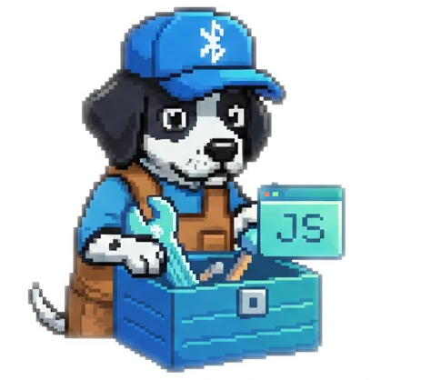

<p align="center">
  
</p>

# Web BLE Kit 📡

[](https://www.npmjs.com/package/web-ble-kit)
[](https://creativecommons.org/licenses/by-nc-sa/4.0/)
[](https://www.typescriptlang.org/)


Build robust BLE device libraries without reinventing the wheel! Web BLE Kit provides all the infrastructure you need: connection management, retry logic, state machines, event handling, and more.

---

## ✨ Features

- 🔌 **Connection Pool** — Manage multiple BLE connections with automatic cleanup
- 🔄 **Smart Retry** — Exponential backoff with jitter for flaky connections
- 📡 **Notifications** — Easy characteristic subscriptions with proper cleanup
- ⏱️ **Timeouts** — Configurable timeouts for all BLE operations
- 🎛️ **State Machine** — Track connection states with type-safe transitions
- 📢 **Event Emitter** — Type-safe pub/sub for reactive updates
- 💾 **Device Memory** — Remember devices across sessions
- 🛡️ **Type-Safe** — Full TypeScript support with strict null checks

---

## 🚀 Quick Start

### Installation

```bash
npm install web-ble-kit
```

### Basic Usage

```typescript
import {
  createWebBluetoothAdapter,
  startNotifications,
  writeWithTimeout,
  withRetry,
} from 'web-ble-kit';

// Create an adapter for your device
const adapter = createWebBluetoothAdapter({
  namePrefixes: ['MyDevice'],
  optionalServices: ['0000ffe0-0000-1000-8000-00805f9b34fb'],
});

// Connect (opens browser device picker)
const session = await adapter.connect({ rememberDevice: true });

// Get your service and characteristic
const services = await session.getPrimaryServices();
const service = services[0];
const chars = await service.getCharacteristics();
const dataChar = chars.find(c => c.properties.notify);

// Subscribe to notifications
const cleanup = await startNotifications(dataChar, (data) => {
  console.log('Received:', new Uint8Array(data));
});

// Write with automatic retry on failure
await withRetry(
  () => writeWithTimeout(dataChar, new Uint8Array([0x01, 0x02])),
  { maxAttempts: 3 }
);

// Cleanup when done
cleanup();
await session.disconnect();
```

---

## 📦 What's Included

### 🔌 Connection Management

```typescript
import { createConnectionPool, createWebBluetoothAdapter } from 'web-ble-kit';

// Manage multiple connections
const pool = createConnectionPool({
  maxConnections: 3,
  createAdapter: () => createWebBluetoothAdapter({ namePrefixes: ['Device'] }),
});

pool.onDisconnect((deviceId) => {
  console.log(`Device ${deviceId} disconnected`);
});

const session = await pool.connect();
await pool.disconnectAll();
```

### 🔄 Retry Logic

```typescript
import { withRetry, isTransientBLEError } from 'web-ble-kit';

// Automatic retry with exponential backoff
const result = await withRetry(
  () => riskyBleOperation(),
  {
    maxAttempts: 5,
    initialDelayMs: 100,
    maxDelayMs: 5000,
    shouldRetry: isTransientBLEError, // Only retry network errors, not user cancellations
  }
);
```

### 📡 Notifications

```typescript
import { startNotifications } from 'web-ble-kit';

// Subscribe with automatic cleanup
const cleanup = await startNotifications(
  characteristic,
  (data) => console.log('Data:', data),
  { signal: abortController.signal } // Optional abort support
);

// Later: cleanup stops notifications and removes listener
cleanup();
```

### 🎛️ State Machine

```typescript
import { createStateMachine } from 'web-ble-kit';

const connection = createStateMachine('disconnected');

connection.onTransition((from, to) => {
  console.log(`${from} → ${to}`);
});

connection.transition('connecting');  // disconnected → connecting
connection.transition('connected');   // connecting → connected
connection.transition('disconnected'); // connected → disconnected
```

### 📢 Event Emitter

```typescript
import { createEventEmitter } from 'web-ble-kit';

interface DeviceEvents {
  data: Uint8Array;
  error: Error;
  connected: void;
}

const events = createEventEmitter<DeviceEvents>();

// Subscribe
const unsub = events.on('data', (data) => console.log(data));
events.once('connected', () => console.log('Connected!'));

// Emit
events.emit('data', new Uint8Array([1, 2, 3]));

// Cleanup
unsub();
events.removeAllListeners();
```

### ⏱️ Timeouts & Abort

```typescript
import { withTimeout, raceWithAbort, AbortError, TimeoutError } from 'web-ble-kit';

// Add timeout to any promise
const result = await withTimeout(
  slowOperation(),
  5000,
  'Operation timed out'
);

// Race with abort signal
const controller = new AbortController();
setTimeout(() => controller.abort(), 1000);

try {
  await raceWithAbort(verySlowOperation(), controller.signal);
} catch (e) {
  if (e instanceof AbortError) console.log('Aborted!');
  if (e instanceof TimeoutError) console.log('Timed out!');
}
```

#### Important: Operation Cancellation Limitations

The Web Bluetooth API does **not support true operation cancellation**. When you abort or timeout a BLE operation:

- The JavaScript promise rejects immediately with `AbortError` or `TimeoutError`
- **The underlying Bluetooth operation continues in the background**
- The write/read may still complete after your code has moved on

**Best Practices:**

```typescript
// After a timeout, verify state before continuing
try {
  await writeWithTimeout(char, data, { timeoutMs: 5000 });
} catch (e) {
  if (e instanceof TimeoutError) {
    // The write may still complete! Check device state before retrying
    const currentValue = await readWithTimeout(char);
    if (/* write succeeded */) {
      // Handle success case
    }
  }
}

// Use operation queues to prevent race conditions
const queue = createOperationQueue();
await queue.enqueue(char.uuid, () => writeWithTimeout(char, data));
```

### 💾 Device Storage

```typescript
import { createLocalStorage, createWebBluetoothAdapter } from 'web-ble-kit';

const storage = createLocalStorage('my-app-device');

const adapter = createWebBluetoothAdapter({
  storage,
  namePrefixes: ['MyDevice'],
});

// First connection: opens picker
await adapter.connect({ rememberDevice: true });

// Later: reconnects automatically without picker
const session = await adapter.reconnect();
```

---

## 📋 API Conventions

### Null vs Undefined Semantics

This library follows consistent conventions for `null` and `undefined`:

| Value | Meaning | Examples |
|-------|---------|----------|
| `null` | Intentionally empty or "not found" | `storage.get()` returns `null` when no device is stored; `extractArrayBuffer()` returns `null` for invalid/empty buffers |
| `undefined` | Not set yet or optional property | `characteristic.value` is `undefined` before first read; optional interface properties |

```typescript
// null = intentionally empty
const deviceId = storage.get(); // null if no device stored
const buffer = extractArrayBuffer(dataView); // null if buffer is detached/empty

// undefined = not yet set
const char: BLEGATTCharacteristic = ...;
console.log(char.value); // undefined before first read/notification
```

---

## 🔒 Security Considerations

### Device Storage

By default, `createLocalStorage()` persists device IDs in the browser's `localStorage`. Be aware:

- **Same-origin access**: Any JavaScript running on the same origin can read stored device IDs
- **XSS vulnerability**: If your app is vulnerable to XSS, attackers could extract device IDs
- **Shared devices**: On shared computers, other users of the same browser profile can access stored data

**Mitigation strategies:**

```typescript
import { createNoOpStorage, createSessionStorage, createWebBluetoothAdapter } from 'web-ble-kit';

// Option 1: Disable persistence entirely
const adapter = createWebBluetoothAdapter({
  storage: createNoOpStorage(),
});

// Option 2: Use session-only storage (cleared when tab closes)
const adapter = createWebBluetoothAdapter({
  storage: createSessionStorage(),
});

// Option 3: Custom encrypted storage
const encryptedStorage = {
  get: () => decrypt(localStorage.getItem('device-id')),
  set: (id: string) => localStorage.setItem('device-id', encrypt(id)),
  remove: () => localStorage.removeItem('device-id'),
};
const adapter = createWebBluetoothAdapter({ storage: encryptedStorage });
```

---

## 🌐 Browser Compatibility

| Browser | Support | Notes |
|---------|---------|-------|
| Chrome 56+ | ✅ Full | Desktop & Android |
| Edge 79+ | ✅ Full | Chromium-based |
| Opera 43+ | ✅ Full | Desktop |
| Chrome Android | ✅ Full | Requires Android 6+ |
| Safari | ❌ None | No Web Bluetooth support |
| Firefox | ⚠️ Flag | Experimental flag required |

---

## 🛠️ Development

```bash
git clone https://github.com/Mwea/web-ble-kit.git
cd web-ble-kit
npm install
npm test
```

| Script | Description |
|--------|-------------|
| `npm test` | Run test suite (444 tests) |
| `npm run typecheck` | TypeScript type checking |
| `npm run build` | Build for distribution |
| `npm run lint` | Run biome linter |

---

## 📄 License

This project is licensed under [CC BY-NC-SA 4.0](https://creativecommons.org/licenses/by-nc-sa/4.0/).

- **Attribution** — Give appropriate credit
- **NonCommercial** — Not for commercial purposes
- **ShareAlike** — Same license for derivatives

---

## 🔗 Related Projects

- [walkingpad-js](https://github.com/Mwea/walkingpad-js) — Control WalkingPad treadmills (built with web-ble-kit)

---

<p>
  Made with ❤️ by <a href="https://github.com/Mwea">Mwea</a> & <a href="https://claude.ai">Claude</a>
</p>
